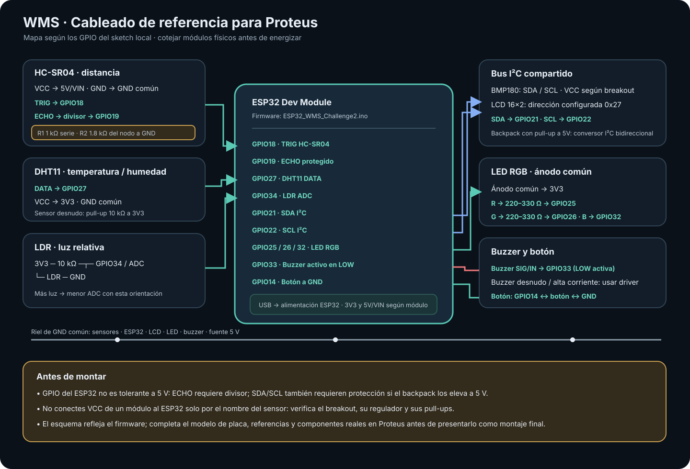

# 4. Diseño e implementación de hardware

## 4.1. Configuración prevista en el firmware

El mapa de esta página se tomó del sketch del segundo corte. Describe las conexiones que el firmware espera; antes de afirmar que son las conexiones del prototipo final, debemos cotejarlas con las piezas prestadas y el montaje que rearmamos.

| Componente previsto | Variable o función | Pines definidos en el sketch |
|---|---|---|
| HC-SR04 | Distancia entre el sensor y la superficie del agua | TRIG GPIO18; ECHO GPIO19 mediante divisor de tensión |
| DHT11 | Temperatura y humedad relativa | DATA GPIO27 |
| BMP180 | Presión atmosférica por I²C | SDA GPIO21; SCL GPIO22 |
| LDR con divisor resistivo | Luz relativa por ADC; no irradiancia calibrada | GPIO34 / ADC |
| LCD 16×2 con backpack I²C | Visualización local | SDA GPIO21; SCL GPIO22; dirección configurada `0x27` |
| LED RGB de ánodo común | Estado normal, preventivo, crítico o falla | R GPIO25; G GPIO26; B GPIO32; un resistor en cada canal |
| Buzzer activo en LOW | Alarma física de riesgo crítico | GPIO33 |
| Botón | Cambio de pantalla leído desde el superloop | GPIO14 a GND con `INPUT_PULLUP` |
| ESP32 Dev Module | Adquisición, fusión, servidor web y control | Alimentación por USB; rieles 3V3, 5V/VIN y GND según la placa |

El sketch configura **DHT11 y LDR**. No configura DHT22 ni BH1750. El botón se consulta desde el superloop; no se debe describir como una interrupción sin cambiar y verificar el firmware. El LCD y el BMP180 comparten el bus I²C.

## 4.2. Esquemático y protección eléctrica

El mapa visual, las conexiones completas y el prompt para dibujarlo en Proteus están en [`docs/ESQUEMA_PROTEUS.md`](../docs/ESQUEMA_PROTEUS.md) y [`docs/esquema_wms.svg`](../docs/esquema_wms.svg). Los puntos que debemos respetar son:

- El HC-SR04 se alimenta a 5 V. Su salida ECHO se reduce con un divisor antes de llegar a GPIO19; no conectamos la salida de 5 V directamente al ESP32 [6], [7].
- El DHT11, la rama analógica del LDR y el lado de 3.3 V del ESP32 comparten GND. Si el DHT11 es el sensor desnudo, se necesita el pull-up de DATA; algunos módulos ya lo incluyen.
- El LDR se conecta como divisor y su orientación debe coincidir con la calibración del ADC. El porcentaje que muestra el firmware es relativo al montaje, no porcentaje de llenado ni W/m².
- El BMP180 y el LCD comparten SDA/SCL. Si el backpack del LCD eleva I²C a 5 V, debemos poner un conversor de nivel bidireccional.
- El LED RGB de ánodo común necesita resistores limitadores individuales. Si el buzzer disponible no es un módulo activo en LOW, hace falta adaptar el circuito o la lógica.
- Todos los módulos, incluido el suministro externo de 5 V si se utiliza, deben compartir tierra.

## 4.3. Variables de montaje que faltan por confirmar

La foto de un render o un diagrama no demuestra cómo quedó armado el prototipo. Para cerrar esta sección agregaremos la referencia exacta de los módulos, fotos del montaje real, el esquema final de Proteus y las mediciones tomadas con multímetro.

### Preguntas para documentar el montaje real

- ¿Qué modelo exacto de placa ESP32 usamos y cómo aparece su pinout en Proteus?
- ¿Qué módulos recuperamos después de rearmar el dispositivo del primer corte y cuáles fueron reemplazados?
- ¿El sensor ambiental instalado es DHT11? ¿Es un sensor desnudo o una placa que ya trae resistor?
- ¿Cuál es la referencia exacta del breakout BMP180 y qué tensión admite su entrada VCC?
- ¿El backpack del LCD tiene pull-ups I²C a 5 V? ¿Instalamos conversor de nivel?
- ¿Qué dirección I²C detectamos en el montaje y coincide con `0x27` del código?
- ¿Qué valores medimos en el divisor del pin ECHO antes de conectar GPIO19?
- ¿Qué resistores usamos en el divisor del LDR y qué lecturas ADC registramos en oscuridad y con luz?
- ¿El LED RGB es de ánodo común y cuál es el orden físico de sus terminales?
- ¿El buzzer es activo en LOW y qué driver o módulo utilizamos?
- ¿Qué distancia medimos desde el sensor hasta el agua con el recipiente lleno y en el nivel mínimo aceptable?
- ¿Qué fotografía, captura de Proteus y evidencia de pruebas añadiremos para que otra persona pueda reproducir el cableado?
